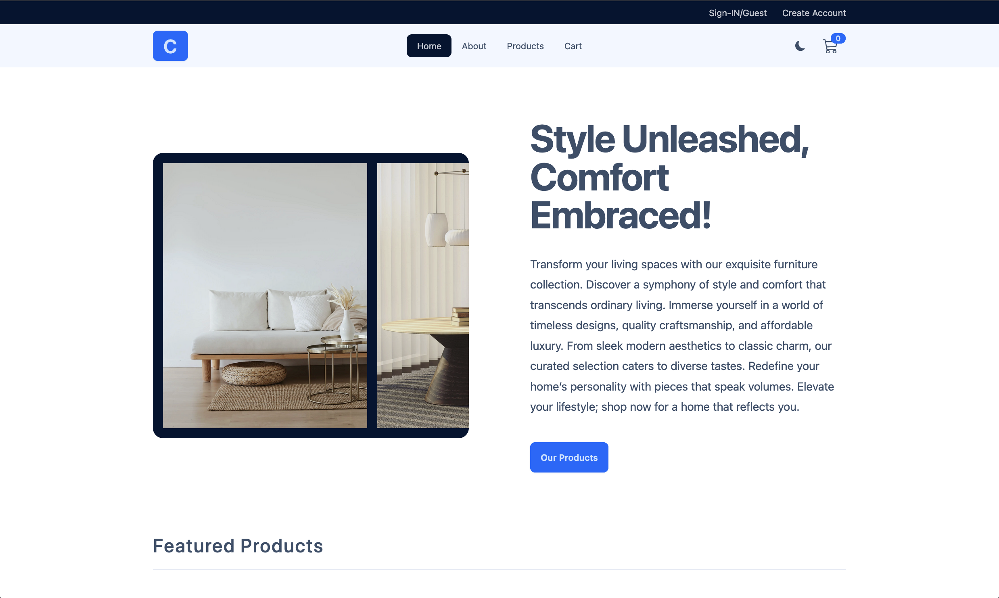
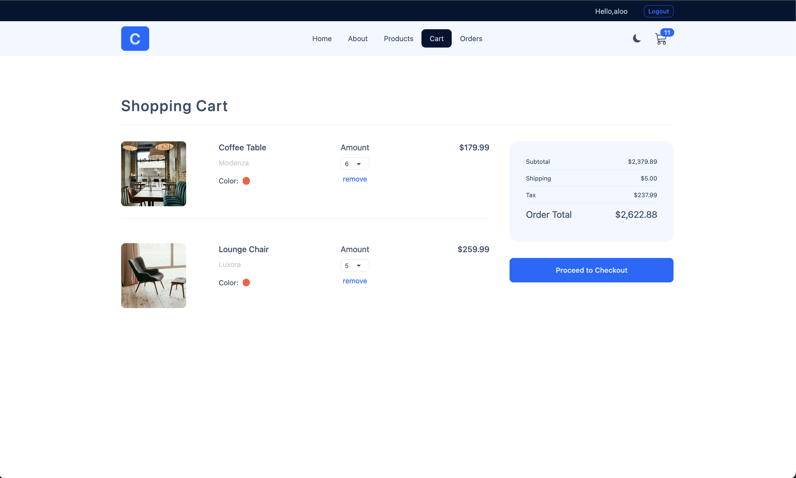
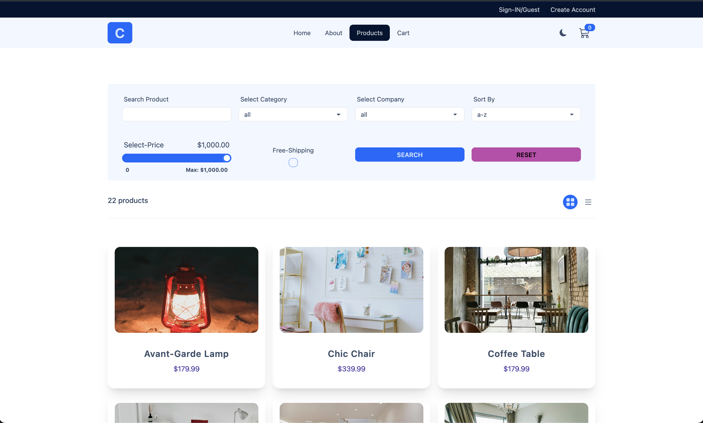
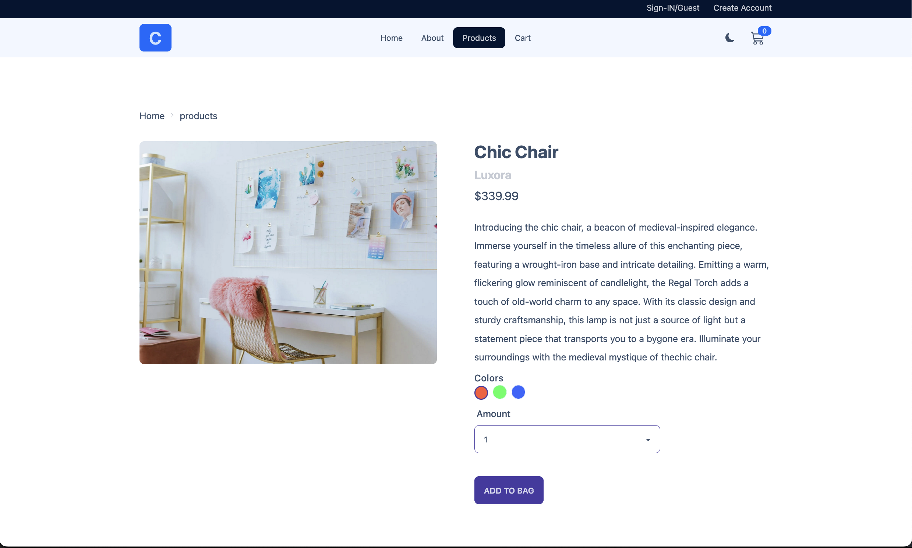
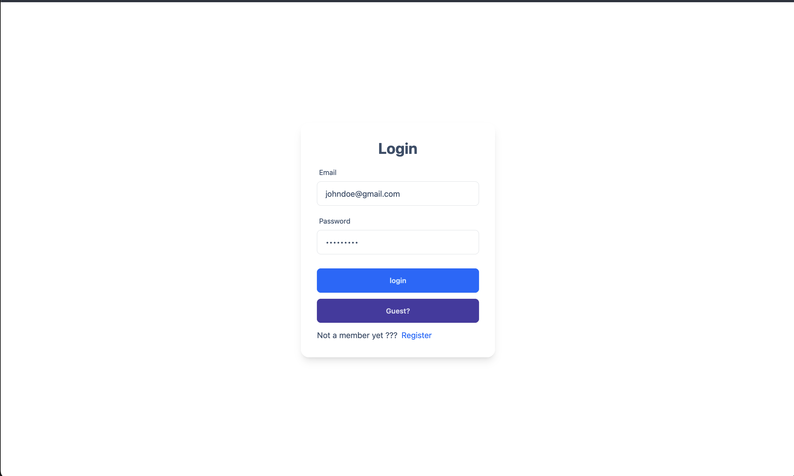
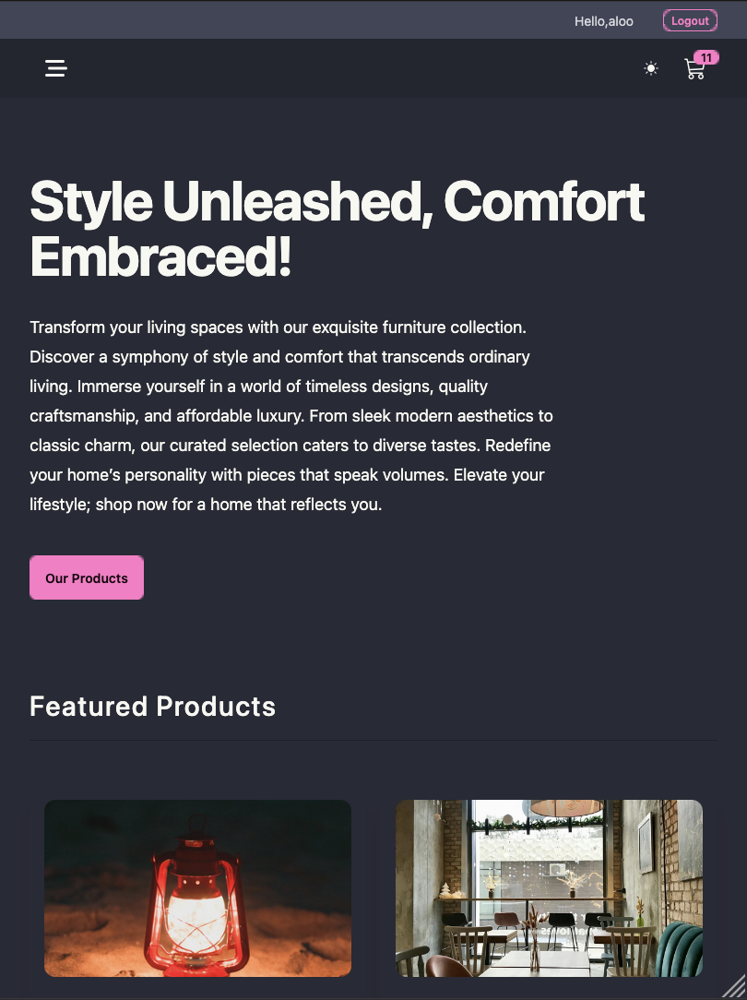
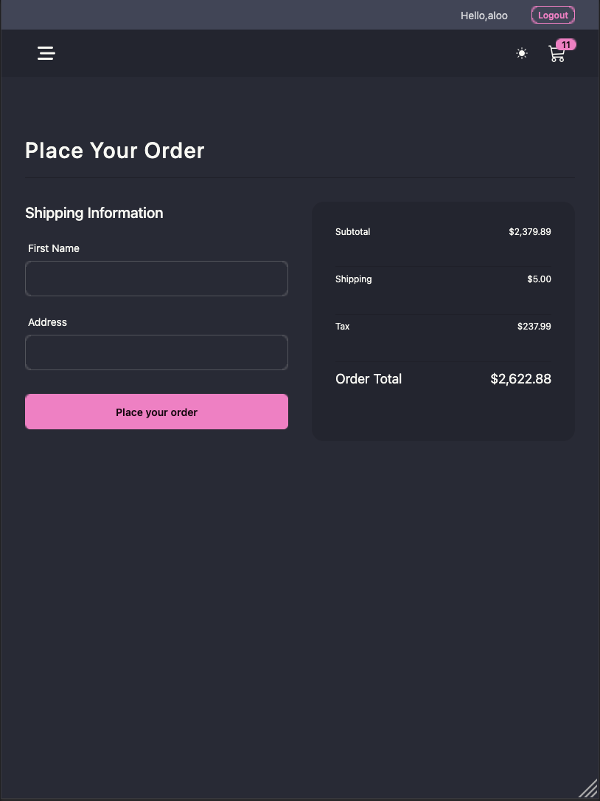
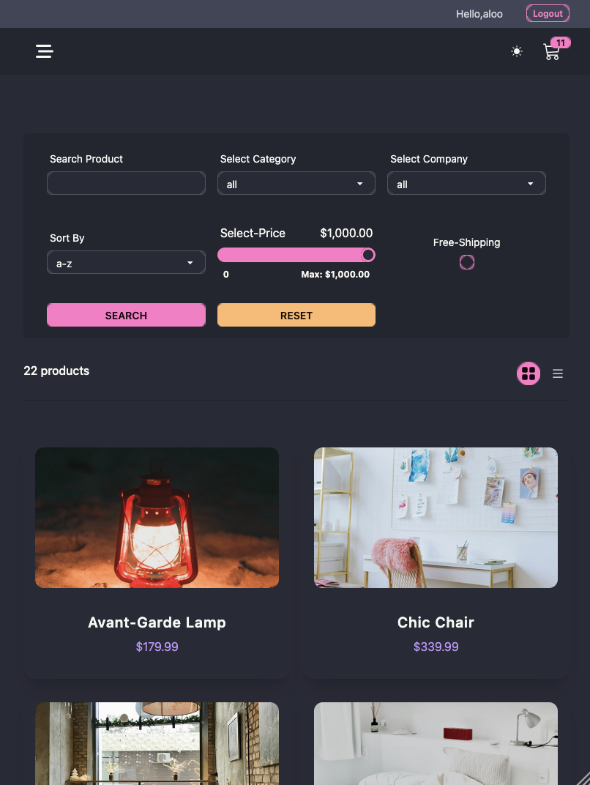
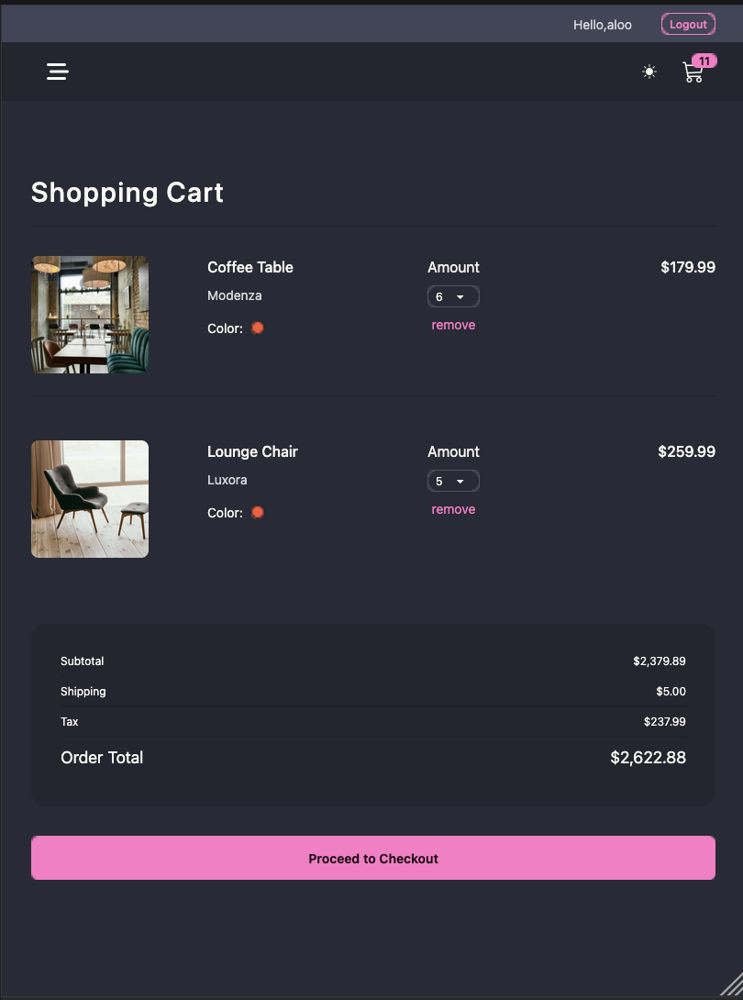

# 🏬 Comfy Store

**Comfy Store** is a responsive e-commerce frontend application built with **React 18** and modern tooling. It demonstrates key frontend concepts like reusable components, global state management, API integration, and UI consistency across devices.

## 📸 Screenshots

### 🖥️ Desktop Screenshots

<p align="center">
  
  
  
  
  
</p>

### 📱 Mobile Screenshots

<p align="center">
  
  
  
  
</p>

## ⚙️ Tech Stack

| Category         | Tools & Libraries                                                                          |
| ---------------- | ------------------------------------------------------------------------------------------ |
| Framework        | [React 18](https://reactjs.org/)                                                           |
| Build Tool       | [Vite](https://vitejs.dev/)                                                                |
| Styling          | [Tailwind CSS](https://tailwindcss.com/), [DaisyUI](https://daisyui.com/)                  |
| State Management | [Redux Toolkit](https://redux-toolkit.js.org/), [React Redux](https://react-redux.js.org/) |
| Data Fetching    | [React Query](https://tanstack.com/query/latest), [Axios](https://axios-http.com/)         |
| Routing          | [React Router DOM](https://reactrouter.com/en/main)                                        |
| Notifications    | [React Toastify](https://fkhadra.github.io/react-toastify/)                                |
| Icons            | [React Icons](https://react-icons.github.io/react-icons/)                                  |
| Date Utils       | [Day.js](https://day.js.org/)                                                              |
| Linting          | ESLint + React plugins                                                                     |

## 🚀 Getting Started

### 1. Clone the repository

```bash
git clone <your-frontend-repo-url>
cd comfy-store
```

### 2. Install dependencies

```bash
npm install
# or
yarn install
```

### 3.Start development server

```bash
npm run dev
# or
yarn dev
```

Visit: http://localhost:5173

## 📱 Responsiveness

The UI is fully responsive, following a mobile-first approach. It adapts seamlessly across:

    ✅ Mobile Phones

    ✅ Tablets

    ✅ Desktops

All styling is handled with tailwindcss and daisyui for quick and consistent UI development.
